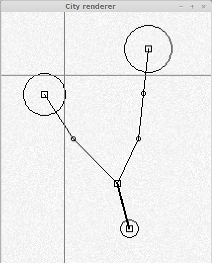

## Cities

A module that creates roads, settlements, etc. procedurally from random numbers.

## Testing

To test this module, you can use the main method in this class

    org.terasology.testing.SwingTest

## Literature

Stiny 75/78/80

* Shape/Palladian Grammar

Different types of procedural generation exist(Middelhoff05):

* Grammar-based L-Systems with extensions (ParishMüller01)

* Agent-based(Lechner+05)

