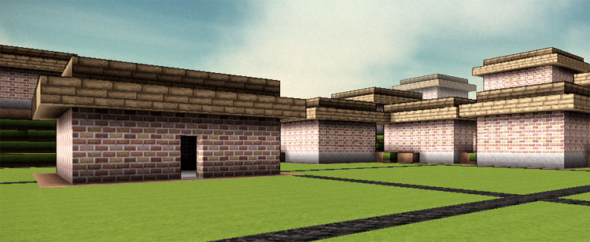

## Cities

A module that creates roads, settlements, etc. procedurally from random numbers.

### Testing

To test this module, you can use the main method in this class

    org.terasology.testing.SwingTest

### Literature

* Introduction to Shape and Shape GrammerShape[Stiny 75/78/80]
Mathematical foundation on how to use rules to replace a shape with another

* Introduction to Urban Simulation[WaddellUlfarsson]
tbd

* Procedural 3D Modeling of Cityscape[Middelhoff05]:
Three distinct simulation types: L-Systems, agent-based and stochastic.

* Grammar-based L-Systems with extensions (ParishMüller01)
L-Systems with self-intersection detection

* Interactive Geometric Simulation of 4D Cities[Weber+08]
Based on [ParishMüller01], but more sophisticated.

* Modeling the Appearance and Behaviour of Urban Spaces[Vanegas+09]
Nice survey on Roads, Buildings, Land Use and Rendering.

* Procedural Modeling of Land Use In Cities[Lechner+05]
Uses 2D agent-based simulation with SimCity3000 vis.

