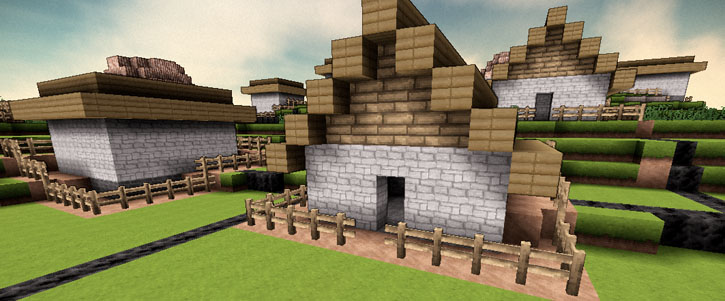
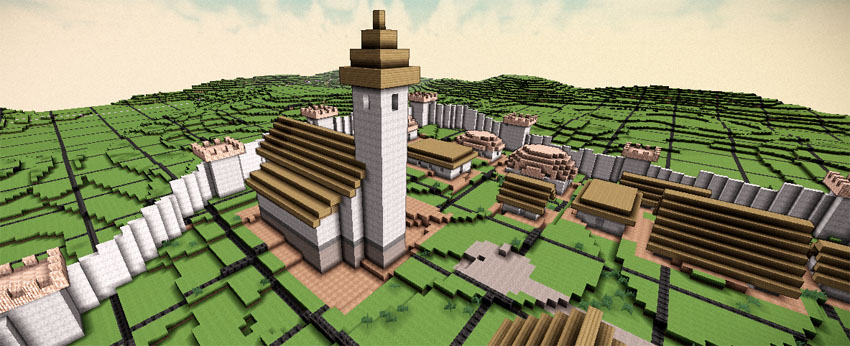

## Cities

A module that creates roads, settlements, etc. procedurally from random numbers.

This module contains a world generator `City Worlds` that creates grassland terrain based on random noise. This terrain is populated with randomly generated settlements of different sizes. 

### Setup

To see what it looks like, just add the module to your Terasology installation using 

    gradlew fetchModuleCities
	
When the game starts, create a new world using the `City Worlds` generator and ... explore !

### Overview

The world is partitioned into square-shaped `Sector`s. For every sector, up to three suitable locations for settlements are determined. 
Long-distance roads are added to connect them in a pair-wise manner. Then, lots (and smaller streets) are created around the center.
Finally, buildings and city furniture are generated.

Basically, every part of this module can be separated into three distinct parts:

* A world entity definition, such as `RomanesqueChurch`, that contains all information on a particual model (size, height, windows, roof type, and so on). This is basically a POJO.

* A generator that creates different instances of `RomanesqueChurch` based on random numbers.

* A rasterizer that converts `RomanesqueChurch` instances into blocks. This is often a composite of several other rasterizers and a 3D brush.

### Contributing

Actually, this is the fun part and it's really easy to do. Just create your own triple of entitiy definition, entity generation and entity rasterization to add a new element to the world. 

### Debugging 

There is a terrain generator `BoundaryGenerator` that creates a grid along sector and chunks borders (using magenta and black blocks).

You can also use the main method in this class to view the generated world in a 2D top-down perspective:

    org.terasology.testing.SwingTest
	

### Acknowledgements

We would like to thank [D. Gilbert of Object Refinery Limited](http://www.object-refinery.com) and Armin Joachimsmeyer for their friendly support.
	

### Literature Overview

* Introduction to Shape and Shape GrammerShape[Stiny 75/78/80]
Mathematical foundation on how to use rules to replace a shape with another

* Introduction to Urban Simulation[WaddellUlfarsson]
tbd

* Procedural 3D Modeling of Cityscape[Middelhoff05]:
Three distinct simulation types: L-Systems, agent-based and stochastic.

* Grammar-based L-Systems with extensions (ParishMüller01)
L-Systems with self-intersection detection

* Interactive Geometric Simulation of 4D Cities[Weber+08]
Based on [ParishMüller01], but more sophisticated.

* Modeling the Appearance and Behaviour of Urban Spaces[Vanegas+09]
Nice survey on Roads, Buildings, Land Use and Rendering.

* Procedural Modeling of Land Use In Cities[Lechner+05]
Uses 2D agent-based simulation with SimCity3000 vis.

* Konzeption & Realisierung eines prozeduralen Ansatzes zur Erzeugung von Gebäuden (Janusch, 2007)
tbd

### License

This module is licensed under the [Apache 2.0 License](http://www.apache.org/licenses/LICENSE-2.0.html).
